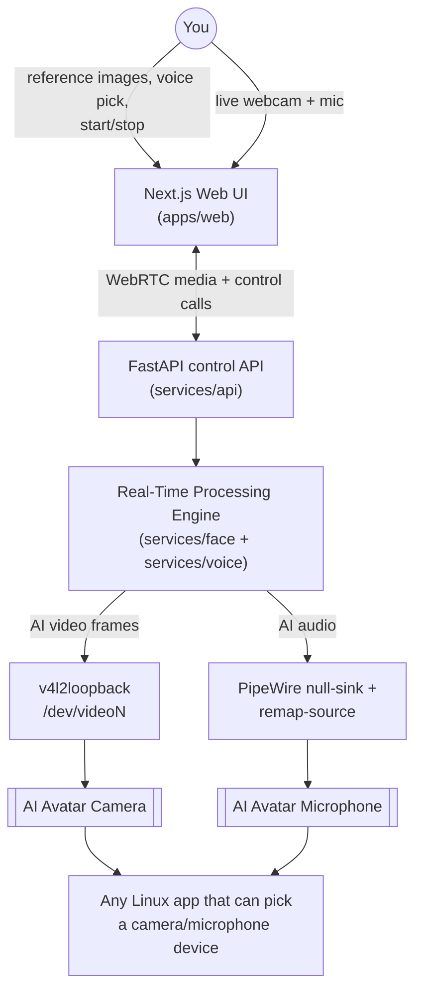
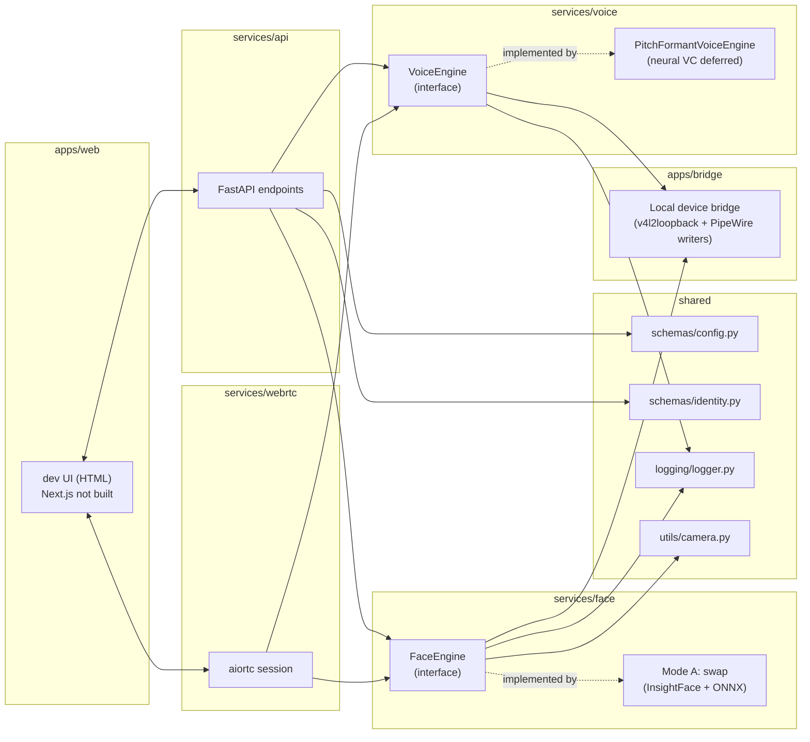
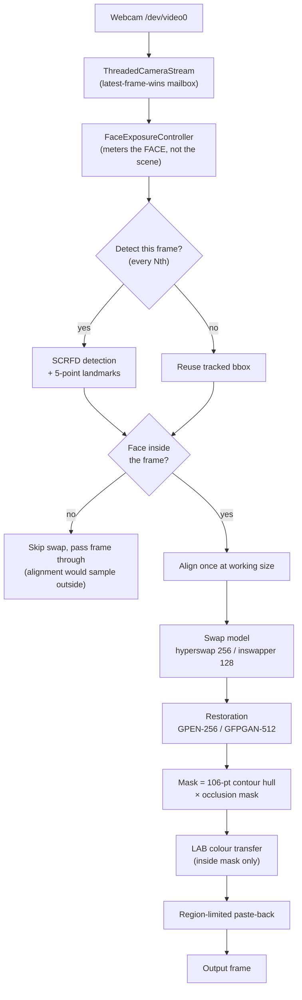
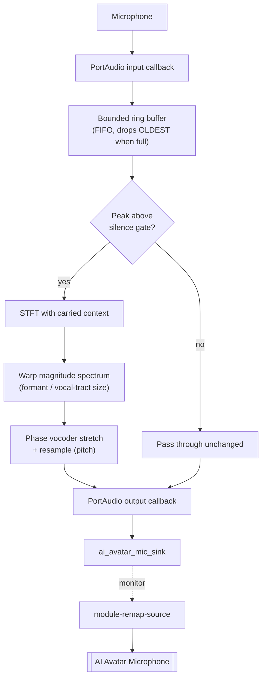
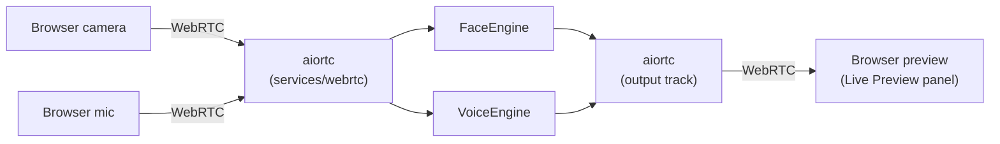
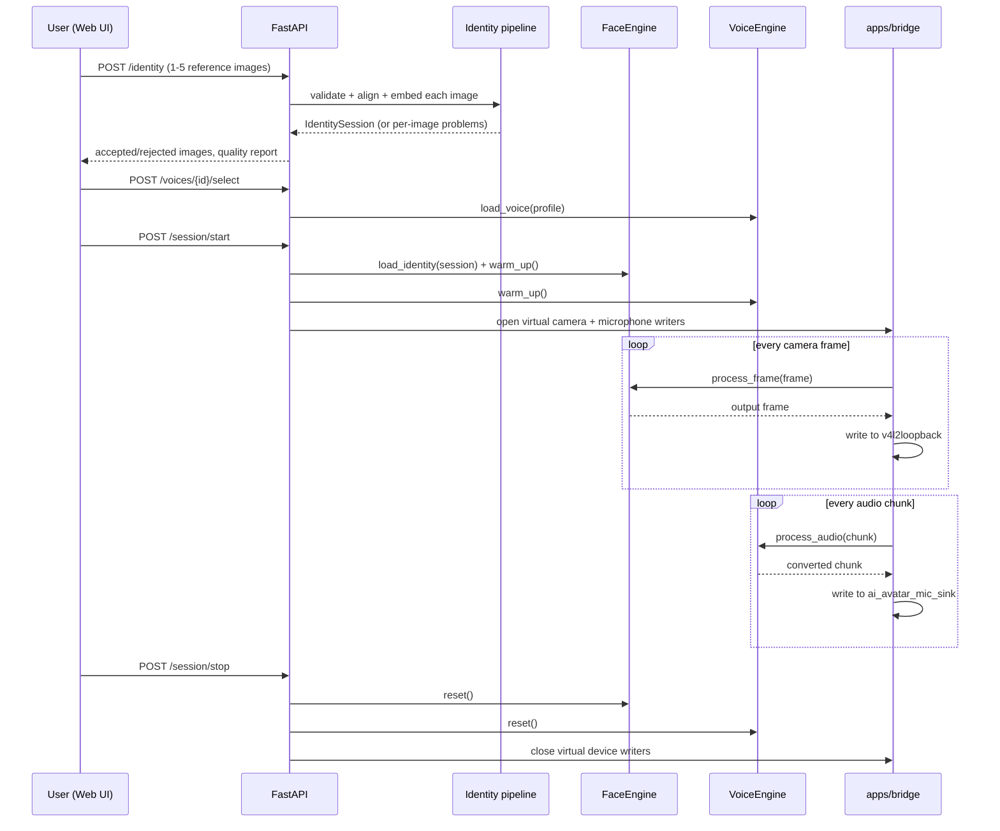

# Architecture

Real-Time AI Avatar is a single-user, local-first system: one Ubuntu machine, one
GPU, one person in front of the webcam. Every diagram below reflects that — no
distributed services, no multi-tenancy, no message brokers (Section 31).

## System Context

The web UI is a control surface and preview, not the only consumer of the
output — the whole point of exposing standard OS virtual devices is that any
Linux app that lets you pick a camera/microphone can use them, independent of
the browser.

## Component Diagram

`FaceEngine` and `VoiceEngine` are abstract interfaces (`services/face/engine.py`,
`services/voice/engine.py`) precisely so Mode A can be swapped for Mode B, or one
voice backend for another, without touching the API or the bridge.

## Video Pipeline (as built)

Two things this diagram encodes that cost real measurement to learn:

* **One alignment, one paste-back.** Swap and restoration share them. Doing
  each stage's own align/warp/mask/blend measured 203 ms vs 168 ms for
  identical output.
* **The mask is a product, not a union.** A pixel is painted only if it is
  *both* inside the face contour *and* not occluded. A max/OR would paint over
  a raised hand.

Detection does not run on every frame (Section 6): a full detection pass runs
every `face.detection_interval` frames (config), and the tracked box/landmarks
carry over in between. If the camera itself can't sustain the target FPS — see
the Milestone 2 finding in `docs/PROGRESS.md`, where this exact webcam capped at
~15 FPS in low light — the pipeline's real ceiling is measured at session start
and downstream stages target that measured rate, not an assumed 30.

## Audio Pipeline (as built)

Audio deliberately does **not** use the video pipeline's latest-frame-wins
rule. A dropped video frame costs one stale image; dropped audio is an audible
click. The ring stays ordered and bounded, and when it does overflow it
discards the oldest block and counts it — keeping the oldest instead would let
the speaker drift seconds behind the microphone.

No AI runs inside the PortAudio callbacks: those are the device's own threads,
and a slow callback underruns the stream.

Verified independently of any voice model (`docs/PROGRESS.md`, Milestone 12):
audio written to `ai_avatar_mic_sink` is genuinely recordable from the
`AI Avatar Microphone` source — a 440 Hz test tone round-tripped end to end.
The conversion stage exists and is measured (Milestone 8), but is **not yet
wired into this path** — connecting the engine to the live capture loop and on
into the sink is the remaining work.

## WebRTC Pipeline — DESIGN ONLY, NOT BUILT

The browser preview is served as MJPEG over HTTP today. The WebRTC path below
was designed but never implemented (Milestone 15).

Media is decoded once on ingest and encoded once on egress — no intermediate
re-encode round-trip (Section 13). This is the browser's live-preview path
only; the actual OS-level virtual devices (the point of the project) are fed
directly by the processing engine via `apps/bridge`, not by looping back
through WebRTC.

## Sequence — Starting a Session

Partly aspirational: the identity and session steps are real, the voice
selection and virtual-device writer steps are not yet wired.

## Why native processes, not Docker, for the runtime

`nvidia-container-toolkit` is installed on this machine (confirmed in
`docs/ENVIRONMENT_REPORT.md`), so containerizing the GPU workload is possible —
but camera (`/dev/video0`) and PipeWire socket passthrough into a container add
real friction (device cgroup rules, `--group-add`, mounting the user's runtime
dir) for a single-user local app with no deployment/isolation requirement to
justify it (Section 31). The AI runtime runs as native Python processes in a
venv; Docker stays available for genuinely isolated sub-tools if one ever
earns its place, not as the default execution path.

## Concurrency (Section 26)

| Worker | Responsibility | Queue discipline |
|---|---|---|
| Camera capture thread | Read camera at native rate | 1-slot mailbox, latest-frame-wins (`ThreadedCameraStream`) |
| Face processing worker | Detection/tracking + inference | Consumes latest frame only; never blocks capture |
| Video output worker | Write to v4l2loopback | Drops a frame rather than blocking on a slow writer |
| Audio capture worker | Read mic PCM | Bounded ring buffer; tracks overruns |
| Voice processing worker | VAD + conversion | Bounded queue; underrun tracked and logged, not silently stretched |
| Audio output worker | Write to PipeWire sink | Bounded queue |
| Metrics worker | Aggregate FPS/latency/VRAM | Pull-based (`/metrics`), not push, to avoid another moving queue |

A slow AI inference call must never stall camera capture or mic capture — each
has its own thread and a bounded, latest-wins (video) or bounded-FIFO-with-
overrun-tracking (audio) queue between them, per Section 25/26.
